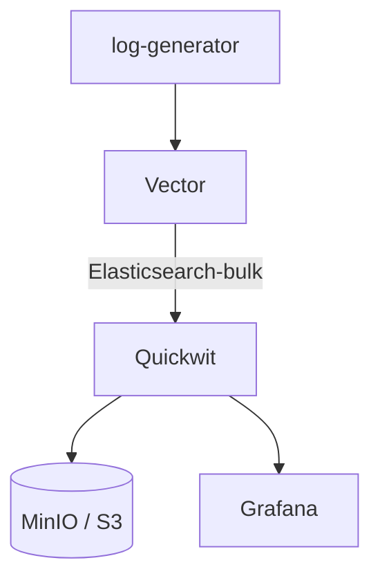
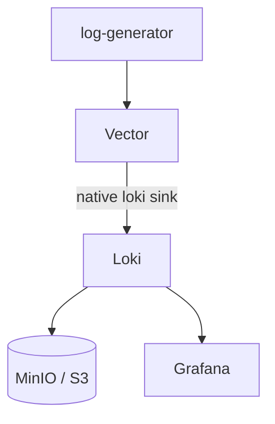
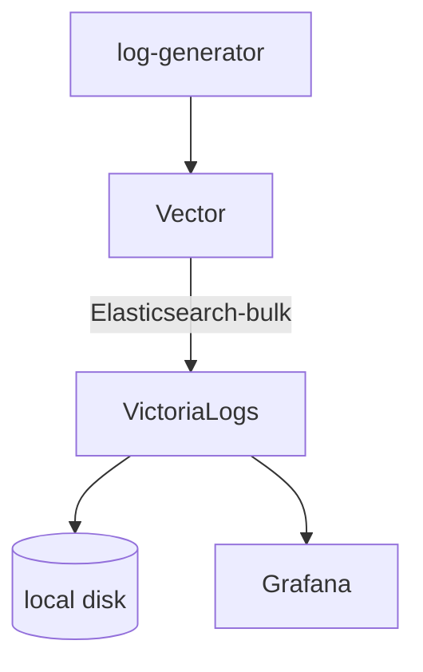

# quickwit-ingestion

Local Kubernetes POC comparing three log engines side by side:
- [Quickwit](https://quickwit.io),
- [Loki](https://grafana.com/oss/loki/)
- [VictoriaLogs](https://docs.victoriametrics.com/victorialogs/).

One [Vector](https://vector.dev) DaemonSet ships the same logs to all three; each gets a matching
[Grafana](https://grafana.com) dashboard.

## Architecture

**Quickwit**


**Loki**


**VictoriaLogs**


## Prerequisites

* kind
* helm
* kubectl
* just
* Docker

## Quickstart

```sh
just up                  # create cluster
just dashboard-grafana   # http://localhost:3000
just down                # tear down
```

## Benchmarking

`logsample/generate.go` generates a synthetic, messy, high-cardinality log corpus.
`bench/ingest.py` / `bench/query.py` push it into each engine's native API directly (bypassing Vector) and time it.

```sh
just bench                # generate 200MB, ingest, query, report
just bench 50GB           # bigger corpus
just bench-report         # reprint last results without rerunning
```

### Results (500MB corpus)

**Ingest**

| Engine | Docs | Size | Time | Docs/s | MB/s | Failed |
|---|---|---|---|---|---|---|
| Quickwit | 1,297,872 | 574.6MB | 35.6s | 36,408 | 16.1 | 0 |
| VictoriaLogs | 1,297,872 | 574.6MB | 64.0s | 20,290 | 9.0 | 0 |
| Loki | 1,175,872 | 568.9MB | 109.8s | 10,709 | 5.2 | 61 |

**Query latency, p50 / p95 (ms)**

| Query | What it means | Quickwit | VictoriaLogs | Loki |
|---|---|---|---|---|
| match_all | Show me everything, no filter — the simplest possible query | 15 / 84 | 13 / 51 | 10 / 68 |
| term_filter | Show me only ERROR-level lines — filtering on a field every engine indexes | 16 / 85 | 13 / 35 | 7 / 55 |
| text_search | Free-text search for the word "failed" anywhere in the log message | 15 / 88 | 202 / 293 | 6300 / 6956 |
| point_lookup | Find the one log line for a specific request ID — like looking up one order in a warehouse | 16 / 83 | 7 / 26 | 7100 / 7734 |
| time_window | Same as match_all, but only the last 5 minutes | 82 / 94 | 8 / 27 | 8 / 52 |

**Resource budget was not equal.** Each backend started at the same 500m CPU / 512Mi memory,
but two needed more just to survive this benchmark's ingest load without crashing:

| Engine | CPU | Memory | Note |
|---|---|---|---|
| VictoriaLogs | 500m | 512Mi | Never needed more |
| Loki | 500m | 2048Mi | OOM-killed repeatedly at 512Mi |
| Quickwit | 825m | 2385Mi | 5 pods; only the indexer needed more (2048Mi), rest are small |

### Conclusion

**Quickwit**
- ✅ Fastest ingest (36k docs/s)
- ✅ Every field indexed — point_lookup as fast as everything else
- ✅ True distributed architecture, S3-native, built to scale out
- ❌ Most complex to run — 5 separate processes
- ❌ Indexer alone needed 4x VictoriaLogs' whole memory budget to survive this ingest load

**Loki**
- ✅ Simple single-binary deployment
- ✅ Fast on indexed-label queries (term_filter, time_window) — competitive with the others
- ❌ By far the worst free-text/point-lookup latency (6–8s) — architectural, it only indexes labels, not log content
- ❌ Needed 4x VictoriaLogs' memory to survive this ingest load
- ❌ Needed manual tuning of rate limits and write-ordering to accept this benchmark's load at all

**VictoriaLogs**
- ✅ Ran the entire benchmark on the smallest budget (512Mi) without ever crashing
- ✅ All 5 query types fast and consistent, zero config tuning needed
- ✅ Simplest ops footprint — single binary, local disk
- ❌ No S3/object storage support — can't decouple compute from storage
- ❌ Slower ingest than Quickwit (20k vs 36k docs/s)
- ❌ Youngest project, smallest ecosystem of the three

