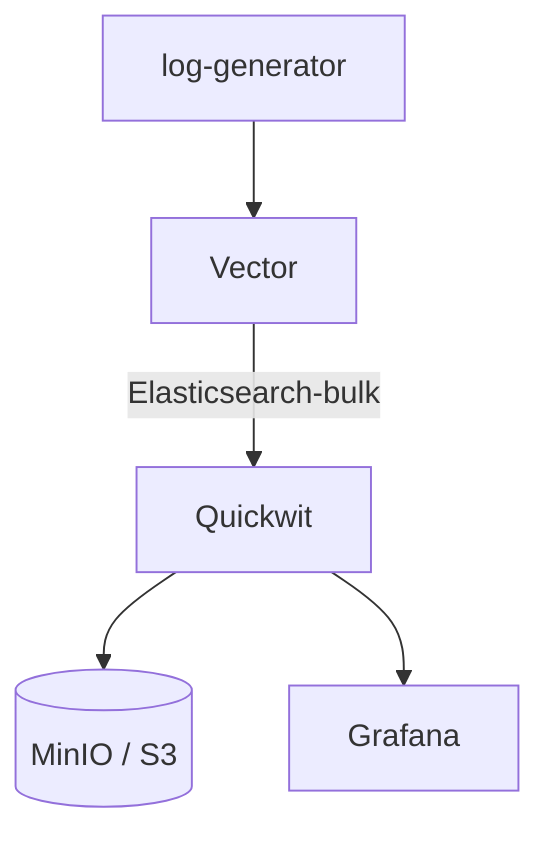
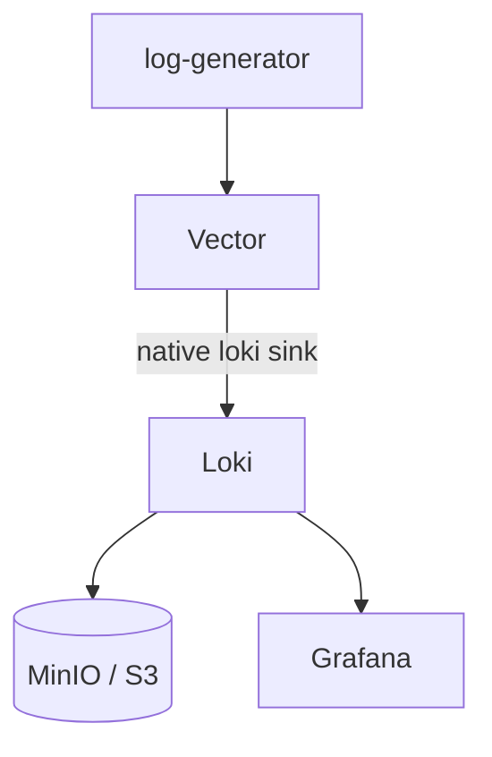
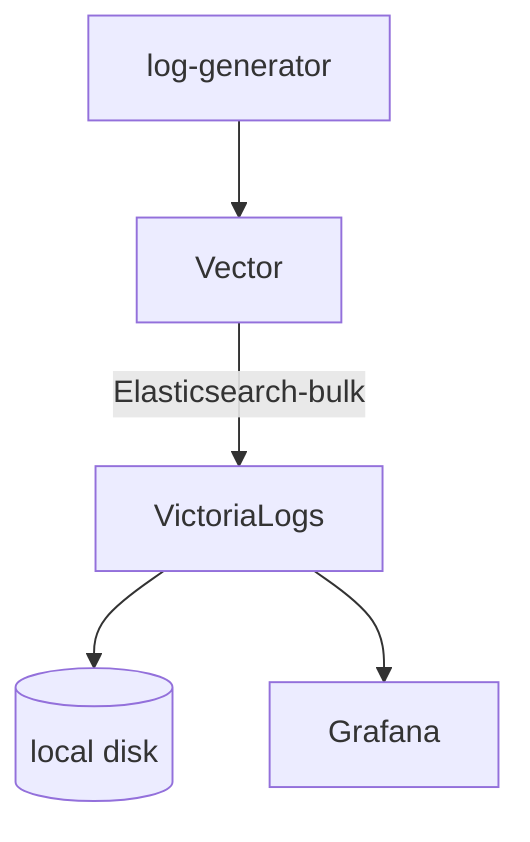

# quickwit-ingestion

Local Kubernetes POC comparing three log engines side by side: [Quickwit](https://quickwit.io),
[Loki](https://grafana.com/oss/loki/), and [VictoriaLogs](https://docs.victoriametrics.com/victorialogs/).
One [Vector](https://vector.dev) DaemonSet ships the same logs to all three; each gets a matching
[Grafana](https://grafana.com) dashboard. Runs in [kind](https://kind.sigs.k8s.io), driven by a
`justfile`. Not a production reference — ephemeral storage, dev-only credentials, anonymous Grafana.

## Architecture

**Quickwit**


**Loki**


**VictoriaLogs**


## Prerequisites

* kind
* helm
* kubectl
* just
* Docker

## Quickstart

```sh
just up                  # create cluster
just dashboard-grafana   # http://localhost:3000
just down                # tear down
```

## Benchmarking

`logsample/generate.go` generates a synthetic, messy, high-cardinality log corpus.
`bench/ingest.py` / `bench/query.py` push it into each engine's native API directly (bypassing Vector) and time it.

```sh
just bench                # generate 200MB, ingest, query, report
just bench 50GB           # bigger corpus
just bench-report         # reprint last results without rerunning
```

### Latest results (500MB corpus)

**Ingest**

| Engine | Docs | Size | Time | Docs/s | MB/s | Failed |
|---|---|---|---|---|---|---|
| Quickwit | 1,297,872 | 574.6MB | 35.6s | 36,408 | 16.1 | 0 |
| VictoriaLogs | 1,297,872 | 574.6MB | 64.0s | 20,290 | 9.0 | 0 |
| Loki | 1,175,872 | 568.9MB | 109.8s | 10,709 | 5.2 | 61 |

**Query latency, p50 / p95 (ms)**

| Query | Quickwit | VictoriaLogs | Loki |
|---|---|---|---|
| match_all | 80 / 92 | 24 / 83 | 1907 / 2283 |
| term_filter | 49 / 86 | 23 / 71 | 316 / 430 |
| text_search | 84 / 100 | 300 / 364 | timeout |
| point_lookup | error (HTTP 500) | 13 / 51 | timeout |
| time_window | 84 / 92 | 8 / 33 | timeout |
